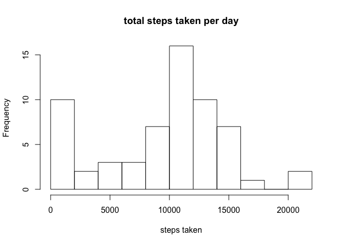

## Loading and preprocessing the data

```r
activity <- read.csv("activity.csv")
activity$steps <- as.numeric(activity$steps)
activity$date <- as.Date(activity$date)
```


## What is mean total number of steps taken per day?
### Calculate the total steps per day and plot it onto a histgram

```r
library(ggplot2)
totalstep <- tapply(activity$steps, activity$date, sum, na.rm=TRUE)
hist(totalstep, main="total steps taken per day", xlab="steps taken", breaks = 10)
```

<!-- -->

### Calculate the mean and median of the total steps per day

```r
mean_step <- mean(totalstep)
median_step <- median(totalstep)
```
The mean of the total number of steps taken per day is 9354.2295082.
The median of the total number of steps taken per day is 1.0395\times 10^{4}


## What is the average daily activity pattern?
### Make a time series plot 

```r
averagestep <- tapply(activity$steps, activity$interval, mean, na.rm=TRUE)
plot(names(averagestep), averagestep, type = "l", xlab="interval", ylab="average steps")
```

<!-- -->

### Which 5-minute interval, on average across all the days in the dataset, contains the maximum number of steps

```r
maxstep <- names(which.max(averagestep))
```
The 5-minute interval that has the maximum number of steps is 835.


## Imputing missing values
### Calculate and report the total number of missing values in the dataset

```r
missing <- sum(is.na(activity$steps))
```
The total number of missing values in the dataset is 2304.

### Devise a strategy for filling in all of the missing values in the dataset

```r
activity$replacesteps <- activity[match(names(averagestep), activity$interval),3]
missing_activity <- data.frame(date=activity$date[is.na(activity$steps)], interval=activity$interval[is.na(activity$steps)], steps=activity$replacesteps[is.na(activity$steps)])
```

### Create a new dataset that is equal to the original dataset but with the missing data filled in

```r
activity_complete <- activity[complete.cases(activity),]
activity_replace <- rbind(activity_complete[,1:3], missing_activity)
```

### Make a histogram of the total number of steps taken each day and Calculate and report the mean and median total number of steps taken per day.

```r
library(ggplot2)
totalstep_complete <- tapply(activity_complete$steps, activity_complete$date, sum, na.rm=TRUE)
mean_step_complete <- mean(totalstep_complete)
median_step_complete <- median(totalstep_complete)
hist(totalstep_complete, main="total steps taken per day", xlab="steps taken", breaks = 10)
```

<!-- -->

The mean of the total number of steps taken per day is 1.0766189\times 10^{4}.
The median of the total number of steps taken per day is 1.0765\times 10^{4}.
The mean and median from the replacing data are close to the original mean and median, but it's not identical. That's because we replace the NA with the average steps for each interval throughout days.


## Are there differences in activity patterns between weekdays and weekends?
###Create a new factor variable in the dataset with two levels – “weekday” and “weekend”

```r
checkdays <- function(x){
    if(x %in% c("Saturday", "Sunday")){
        return("Weekend")
    
    }
    else{
        return("Weekday")
    }
}
activity$days <- weekdays(activity$date)
activity$week <- lapply(activity$days, checkdays)
activity$week <- as.character(activity$week)
```

### Make a panel plot containing a time series plot

```r
average_step_week <- tapply(activity$steps, list(activity$interval, activity$week), mean, na.rm=TRUE)

average_weekday <- as.data.frame(average_step_week[,1])
average_weekend <- as.data.frame(average_step_week[,2])
colnames(average_weekday) <- "average"
colnames(average_weekend) <- "average"
average_weekday$Intervals <- as.numeric(rownames(average_step_week))
average_weekend$Intervals <- as.numeric(rownames(average_step_week))
average_weekday$days <- rep("weekday", length(average_weekday))
average_weekend$days <- rep("weekend", length(average_weekend))

averageall <- rbind(average_weekday, average_weekend)

library(lattice)
xyplot(average~Intervals|days, data=averageall, type="l", xlab="Interval", ylab="Number of steps", layout=c(1,2))
```

<!-- -->

As is shown in the figure, there is a difference in the pattern between weekdays and weekends. During weekdays, the peak is to the front. During weekends, the peak is throughtout the intervals.


